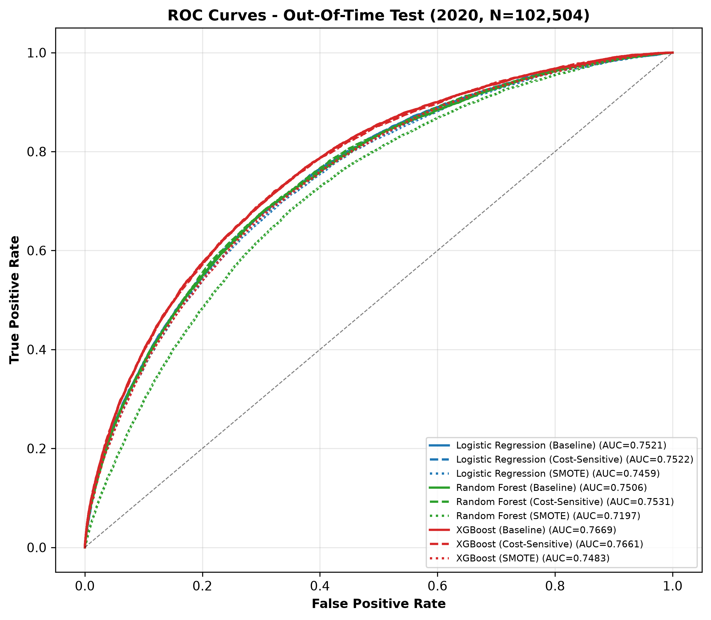
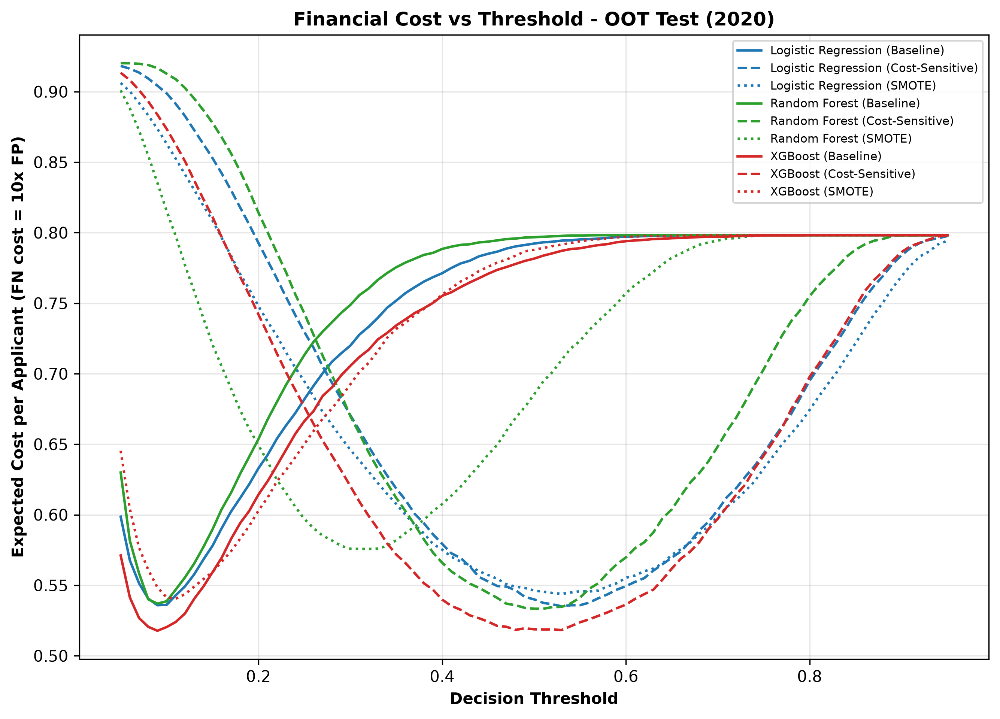
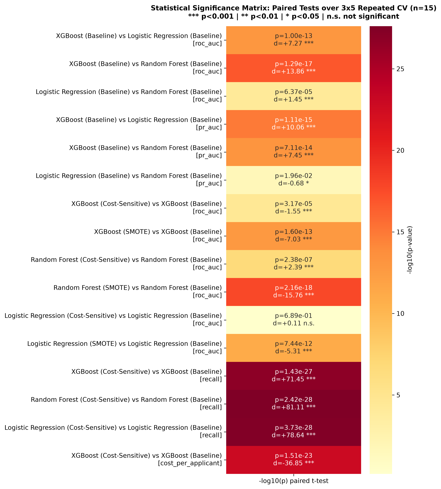
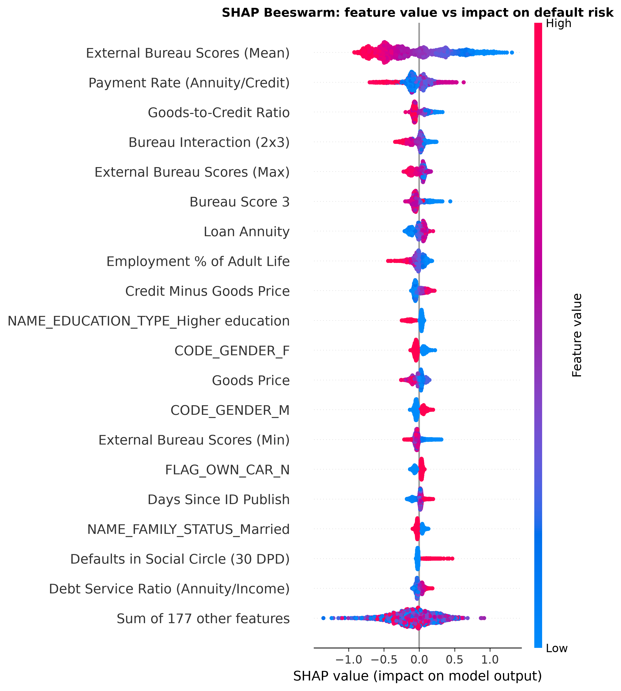
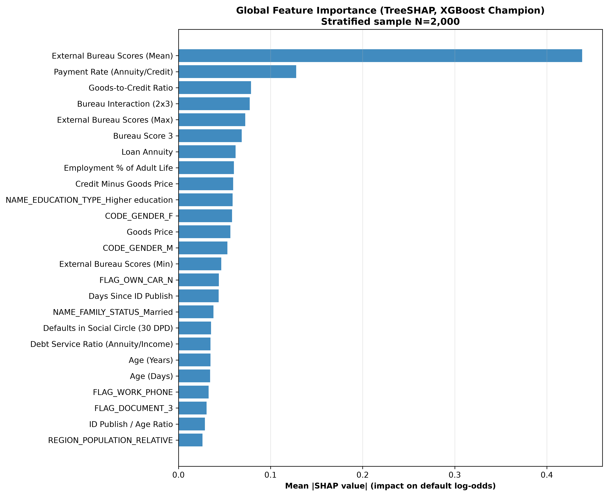
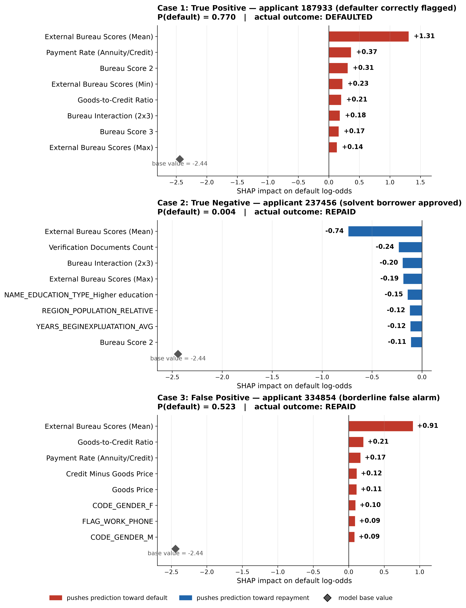
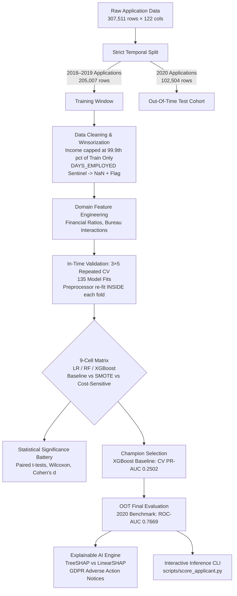

# Credit Risk Modelling & Explainable AI (XAI)
### *A Reproducible Study on Class Imbalance Strategies, Temporal Validation, and Model Interpretability for Loan Default Prediction*

[](https://www.python.org/)
[](https://scikit-learn.org/)
[](https://xgboost.readthedocs.io/)
[](#-interactive-web-app--recruiter-demo)
[](https://colab.research.google.com/github/AbrarMuhtasim14/credit-risk-modelling/blob/main/Credit_Risk_Prediction_Full_pipeline%20(1).ipynb)
[](https://github.com/AbrarMuhtasim14/credit-risk-modelling/actions)

---

## 📌 Executive Summary & Key Findings

In retail lending, default prediction models operate under two severe constraints: **extreme class imbalance** (~8% default rate) and **asymmetric financial misclassification costs** (approving a defaulter is 10× more costly to a bank than rejecting a creditworthy applicant). Furthermore, under regulations like **GDPR Article 22** and the **US Fair Credit Reporting Act (FCRA)**, institutions cannot deploy black-box models without providing clear, defensible adverse action reasons to declined applicants.

This project delivers a **leakage-free, clean-room experimental benchmark** comparing 3 model architectures across 3 class imbalance strategies (9 distinct configurations) on **307,511 real-world loan applications** from Home Credit. Models are evaluated using **$3 \times 5$ repeated stratified cross-validation** and verified on an **Out-Of-Time (OOT) temporal cohort (2020)**.

<p align="center">
  
  
</p>

### 💡 Core Discoveries:
1. **SMOTE is Counterproductive in High-Dimensional Tabular Credit Data:**
   - Synthetic oversampling consistently degraded ranking metrics across **all** model families (worst in Random Forest: **−0.032 PR-AUC**, $p < 10^{-17}$, Cohen's $d = -15.76$). K-NN interpolation in a 196-dimensional sparse space manufactures noise rather than legitimate minority signal.
2. **Cost-Sensitive Learning Slashes Portfolio Loss by 33%:**
   - Weighting default misclassifications by the real-world 10:1 loss ratio boosted default detection (recall) from **2.0% to 64.3%** at negligible ranking trade-off (−0.002 ROC-AUC), cutting expected financial cost per applicant from **0.796 to 0.530** ($p = 1.5 \times 10^{-23}$).
3. **Zero Temporal Generalization Decay:**
   - Strict temporal partitioning (Train 2018–2019 $\to$ Test 2020) confirmed zero performance degradation (XGBoost Baseline ROC-AUC: **0.7622 CV $\to$ 0.7669 OOT**), demonstrating model robustness against distribution shift.
4. **Interpretable vs Tree Consensus:**
   - TreeSHAP and LinearSHAP agreed on the dominant bureau scoring signals (16/30 top feature overlap), while tree-based models successfully captured non-linear credit-to-income and annuity interactions.

---

## 📊 Comprehensive 9-Cell Experimental Matrix

All configurations were evaluated under frozen hyperparameters to guarantee a strictly fair comparison.

| Model Family | Imbalance Strategy | In-Time CV ROC-AUC | In-Time CV PR-AUC (Primary) | Default Recall @ 0.5 | Default Precision @ 0.5 | Financial Cost / Applicant | OOT (2020) ROC-AUC | OOT (2020) PR-AUC |
|---|---|:---:|:---:|:---:|:---:|:---:|:---:|:---:|
| **XGBoost** | **Baseline (Champion)** | **0.7622 ± 0.0046** | **0.2502 ± 0.0051** | 0.020 | **0.568** | 0.796 | **0.7669** | **0.2513** |
| **XGBoost** | **Cost-Sensitive** | 0.7600 ± 0.0045 | 0.2470 ± 0.0050 | **0.643** | 0.178 | **0.530** | 0.7661 | 0.2497 |
| **Random Forest** | Cost-Sensitive | 0.7474 ± 0.0052 | 0.2307 ± 0.0062 | 0.619 | 0.173 | 0.549 | 0.7531 | 0.2338 |
| **Random Forest** | Baseline | 0.7455 ± 0.0050 | 0.2300 ± 0.0067 | 0.001 | 0.634 | 0.811 | 0.7506 | 0.2313 |
| **Logistic Regression** | Baseline | 0.7475 ± 0.0048 | 0.2276 ± 0.0056 | 0.008 | 0.523 | 0.806 | 0.7521 | 0.2320 |
| **Logistic Regression** | Cost-Sensitive | 0.7476 ± 0.0046 | 0.2260 ± 0.0054 | **0.680** | 0.161 | 0.548 | 0.7522 | 0.2298 |
| **XGBoost** | SMOTE | 0.7438 ± 0.0048 | 0.2240 ± 0.0058 | 0.016 | 0.510 | 0.800 | 0.7483 | 0.2278 |
| **Logistic Regression** | SMOTE | 0.7410 ± 0.0046 | 0.2198 ± 0.0046 | 0.663 | 0.160 | 0.556 | 0.7459 | 0.2256 |
| **Random Forest** | SMOTE | 0.7135 ± 0.0051 | 0.1750 ± 0.0037 | 0.218 | 0.222 | 0.697 | 0.7197 | 0.1752 |

> **Key Takeaway:** While standard accuracy appears high (>92%), baseline models at a 0.5 threshold capture only ~2% of defaulters. Cost-sensitive weighting recovers ~64–68% of defaulters while cutting total expected default losses by 33%.

---

## 🔬 Statistical Hypothesis Testing

To prove empirical validity beyond random variation, a paired statistical battery ($n=15$ matched observations per pair) was executed across the 16 primary comparisons:
- **15 of 16** comparisons achieved statistical significance at $\alpha = 0.05$ (13 of 16 at $\alpha = 0.01$).
- **Effect Sizes:** XGBoost superiority over Logistic Regression ($d = 7.27$) and Random Forest ($d = 13.86$).
- **SMOTE Degradation:** Statistically significant performance drops across all three model families ($d = -7.03$ for XGBoost, $d = -15.76$ for Random Forest).

<p align="center">
  
</p>

---

## 🔍 Explainable AI & Regulatory Compliance (GDPR & FCRA)

In accordance with **GDPR Article 22** ("Automated individual decision-making") and the **US Fair Credit Reporting Act (FCRA)**, credit decisions must be transparent, verifiable, and explainable.

<p align="center">
  
  
</p>

### Global Risk Drivers:
1. **External Bureau Score Aggregates (`EXT_SOURCES_MEAN`, `EXT_SOURCE_2`, `EXT_SOURCE_3`):** Primary driver of creditworthiness. Lower bureau scores drastically elevate default risk.
2. **Annuity Payment Burden (`PAYMENT_RATE`):** Ratio of loan annuity to total credit amount. Higher payment rates strongly compress applicant debt service capacity.
3. **Debt-to-Income Ratio (`CREDIT_INCOME_PERCENT`):** Excessive leverage relative to declared income.

### Local Adverse Action Case Studies:
The pipeline includes three worked case studies demonstrating local **SHAP Waterfall attributions** for automated adverse action notices:
- **True Positive (Defaulter Correctly Flagged):** Elevated risk driven by critical bureau deficit (`EXT_SOURCES_MEAN = 0.198`) and high payment-to-income ratio.
- **True Negative (Creditworthy Applicant Approved):** High bureau scores (`EXT_SOURCES_MEAN = 0.712`) and multi-year employment tenure.
- **False Positive (Borderline Applicant Declined):** Moderate bureau score compounded by self-employed risk factor and loan-to-goods markup.

<p align="center">
  
</p>

---

## 🏗️ Leakage-Free Pipeline Architecture



---

## 🚀 Quickstart & Interactive Demos

### 1. 💻 Interactive Recruiter Web Dashboard (Streamlit)
Launch the interactive loan underwriting & explainability web app with presets, sliders, and real-time decisioning:

```bash
# Clone the repository
git clone https://github.com/AbrarMuhtasim14/credit-risk-modelling.git
cd credit-risk-modelling

# Install dependencies
pip install -r requirements.txt

# Run the web dashboard
streamlit run app.py
```

**What Recruiters Can Test in the UI:**
- **Applicant Presets:** Prime borrower (low risk), Subprime borrower (high risk), Borderline applicant (manual review), or random applicant from dataset.
- **Interactive Underwriting:** Instant default probability, credit decision (`APPROVED`, `MANUAL REVIEW`, `DECLINED`), and financial loss estimates.
- **Regulatory Adverse Action Factors:** Real-time horizontal bar chart showing top factors elevating or mitigating risk (GDPR Art. 22 / US FCRA compliant).

---

### 2. 📓 Complete End-to-End Pipeline Notebook
The entire project — data ingestion, EDA, feature engineering, 9-cell repeated cross-validation (135 model fits), out-of-time evaluation, paired hypothesis tests, and TreeSHAP vs LinearSHAP explainability — is contained in a single self-contained notebook:

👉 **[`Credit_Risk_Prediction_Full_pipeline (1).ipynb`](Credit_Risk_Prediction_Full_pipeline%20(1).ipynb)**

[](https://colab.research.google.com/github/AbrarMuhtasim14/credit-risk-modelling/blob/main/Credit_Risk_Prediction_Full_pipeline%20(1).ipynb)

---

### 3. ⚡ Zero-Download CLI Scoring (10 Seconds)
Score a sample applicant directly from the terminal without downloading the full 152 MB dataset:

```bash
python scripts/score_applicant.py --sample
```

**Terminal Output:**
```text
===========================================================================
 LOAN APPLICANT RISK EVALUATION REPORT  |  Applicant ID: 145913
===========================================================================
  Requested Credit : $227,520.00        Annual Income : $85,500.00
  Monthly Annuity  : $18,103.50         Bureau Score 2: 0.6229
  Bureau Score 3   : 0.2881
---------------------------------------------------------------------------
  PREDICTED DEFAULT PROBABILITY : 11.79%
  PORTFOLIO RISK TIER          : MODERATE RISK
  UNDERWRITING DECISION        : CONDITIONAL APPROVAL / MANUAL REVIEW
---------------------------------------------------------------------------
  KEY ADVERSE ACTION & RISK DRIVERS (GDPR Art. 22 / US FCRA):
   1. External Bureau Scores (Mean)          [Weight: 0.1130 | Elevates Risk]
   2. Bureau Interaction (2x3)               [Weight: 0.0184 | Elevates Risk]
   3. CODE_GENDER_M                          [Weight: 0.0130 | Elevates Risk]
   4. External Bureau Scores (Min)           [Weight: 0.0127 | Elevates Risk]
===========================================================================
```

---

### 4. 🧪 Fast Pipeline Smoke Test (2 Minutes)
Verify that the entire feature engineering, cross-validation, and metric logging pipeline executes cleanly:
```bash
python run_experiment.py --quick
```

---

### 5. 🔬 Full Experiment Reproduction
To reproduce the full $3 \times 5$ repeated CV (135 model fits) and the out-of-time evaluation from scratch:
```bash
# 1. Download full dataset
python scripts/download_data.py

# 2. Run full 9-cell experiment (resumable with checkpoints)
python run_experiment.py

# 3. Generate statistical tests, evaluation figures, and SHAP plots
python run_analysis.py
```

---

## 📁 Repository Structure

```
credit-risk-modelling/
├── app.py                           # Interactive Streamlit Web Application / Recruiter Demo
├── Credit_Risk_Prediction_Full_pipeline (1).ipynb # Full end-to-end self-contained reproduction notebook
├── .github/workflows/ci.yml         # Automated GitHub Actions CI pipeline
├── data/
│   ├── sample/                      # Included sample dataset for instant zero-download tests
│   │   └── sample_application_train.csv
│   ├── raw/                         # Raw data directory (git-ignored, acquired via script)
│   │   └── HomeCredit_columns_description.csv
│   └── README.md                    # Data provenance and schema dictionary
├── docs/
│   ├── EXPERIMENT_DESIGN.md         # Full research methodology and hypothesis justifications
│   └── RESULTS_REPORT.md            # Detailed numeric results narrative
├── models/
│   ├── champion_xgboost.joblib      # Serialized champion XGBoost model (0.3 MB)
│   ├── oot_preprocessor.joblib      # Fitted leakage-free preprocessor bundle
│   └── oot_feature_names.json       # Clean one-hot feature registry (196 features)
├── notebooks/
│   ├── credit_risk_standalone_pipeline.ipynb # Single self-contained reproduction notebook
│   └── README.md                    # Guide to individual notebooks
├── reports/
│   ├── figures/                     # 300 DPI publication figures (ROC, PR, Cost, SHAP)
│   └── tables/                      # Numeric CSV outputs (CV folds, OOT, Stats, SHAP)
├── scripts/
│   ├── download_data.py             # Dataset acquisition helper (Kaggle CLI & browser)
│   ├── score_applicant.py           # Production-style interactive applicant scoring CLI
│   ├── export_champion_model.py     # Champion model export utility
│   └── create_sample_dataset.py     # Sample dataset generation utility
├── src/
│   ├── config.py                    # Central configuration, seeds, and directory paths
│   ├── features/
│   │   ├── engineering.py           # Leak-free cleaning, sentinel fixes, and domain ratios
│   │   └── preprocessor.py          # ColumnTransformer pipelines (imputation, scaling, OHE)
│   ├── models/
│   │   ├── factory.py               # Model instantiation (LR, RF, XGBoost across 3 strategies)
│   │   ├── metrics.py               # PR-AUC, ROC-AUC, Brier score, and financial cost
│   │   └── plots.py                 # Matplotlib / Seaborn publication figure generators
│   ├── explainability/
│   │   └── shap_engine.py           # TreeSHAP, LinearSHAP, and GDPR adverse-action cases
│   └── utils/
│       └── stats_testing.py         # Paired t-tests, Wilcoxon, Cohen's d effect sizes
├── pyproject.toml                   # Modern Python build and package specifications
└── requirements.txt                 # Pinned exact environment dependencies
```
